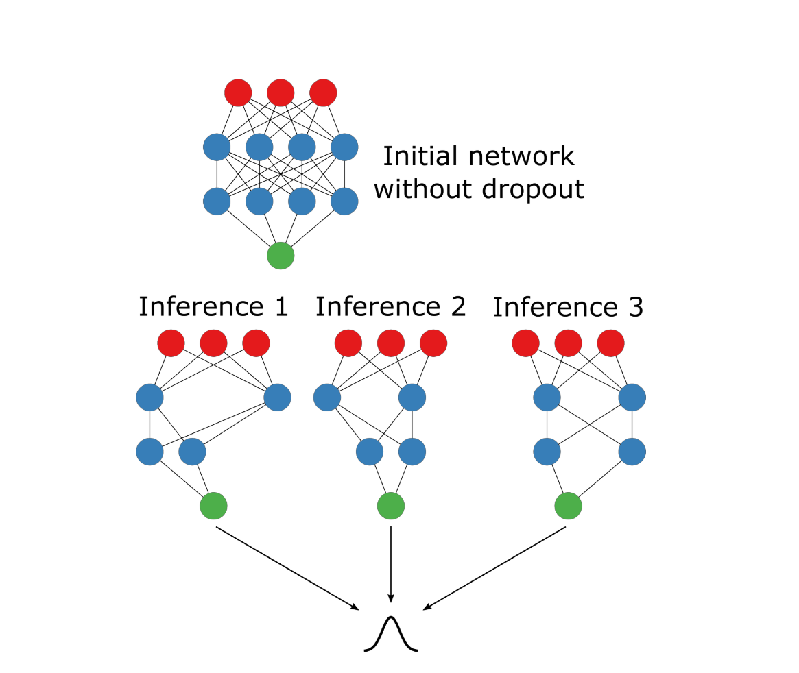

### **Motivation**

- **Clinical Importance:**  
  Pneumonia is a major cause of morbidity and mortality worldwide. Accurate and timely diagnosis through chest X-rays is critical for patient care. However, current AI systems often provide a hard prediction without indicating how confident they are.

- **Trustworthy AI:**  
  In high-stakes scenarios like medical diagnostics, understanding the uncertainty behind a prediction can be as important as the prediction itself. This project aims to incorporate Bayesian methods (via MC Dropout) into a deep learning model so that we can quantify both spatial and predictive uncertainty. This helps clinicians understand whether a high-confidence prediction should be trusted or re-examined.

- **Robustness & Interpretability:**  
  By analyzing uncertainty in both the feature maps and the final prediction, and testing the model under adversarial attacks (like FGSM), we can evaluate and improve the robustness of the model. This is vital to ensure that the system not only performs well on average but is also reliable in edge cases.

---

### **Logistics**

#### **Pretrained Model Used**
- **Model:**  
  We are using a pretrained model for pneumonia detection, such as **DenseNet-121** (or another similar architecture like CheXNet) that has been fine-tuned on chest X-ray images.
  
- **Why This Model:**  
  DenseNet-121 is known for its ability to capture detailed features through dense connectivity, making it a good candidate for medical image classification. It also integrates well with MC Dropout for uncertainty estimation.

#### **Data Source**
- **Dataset:**  
  The project uses the **ChestX-ray14** dataset provided by the National Institutes of Health (NIH).

- **Source:**  
  The dataset can be downloaded from the official NIH repository:  
  [ChestXray-NIHCC](https://nihcc.app.box.com/v/ChestXray-NIHCC).

#### **Dataset Contents**
- **Images:**  
  Over 112,000 frontal-view chest X-ray images, covering various conditions.
- **Annotations:**  
  The dataset contains 14 disease labels (e.g., pneumonia, effusion, atelectasis, etc.).
- **Focus:**  
  For this project, our focus is on pneumonia. The images are preprocessed (resized, normalized) and used as input for the model.

#### **Prediction Task**
- **Objective:**  
  The goal is to detect pneumonia from chest X-ray images. In our setup:
  - **Positive Class:** Pneumonia (the presence of pneumonia).
  - **Negative Class:** Normal (absence of pneumonia) or other conditions.
- **Why Pneumonia:**  
  Pneumonia is clinically significant, and early detection can drastically improve patient outcomes. Our system will not only classify images but also provide an uncertainty estimate to flag cases where the model's prediction might be unreliable.

---

### **Understanding MC Dropout**



*(Credits: Enhancing Deep Learning with Bayesian Inference by Dr. Matt Benatan, Jochem Gietema, Dr. Marian Schneider)*

#### **What is MC Dropout?**

- **Dropout:**  
  Dropout is traditionally used to reduce over fitting in neural network. The main idea is that by randomly turning off(setting the weights to zero) neurons in a layer we force the model to consider other neurons to solve the problem. Therefore, the model is no longer dependent on just a small subset of neurons for prediction. 
  
- **MC Dropout:**  
  However, we can also use the randomness in the Dropout to induce stocasticity in the output during prediction.Thus MC Dropout is a technique that leverages dropout during inference to approximate Bayesian uncertainty.  

  - **During Training:** Dropout is used to randomly “drop” a fraction of neurons to prevent overfitting.  
  - **During Inference:** Instead of disabling dropout, we keep it active. This causes the network to produce **different predictions** for the same input, effectively sampling from a distribution over model outputs.
  
- **Why It Works:**  
  By performing multiple forward passes with dropout enabled, we obtain a set of predictions.  
  - **Mean Prediction:** Represents the final, averaged output.  
  - **Predictive Variance:** Measures the uncertainty; higher variance indicates less confidence in the prediction.

---

### **Implementation in Our Model**

To implement MC Dropout, we modify the prediction process as follows:

#### **Code Snippet: MC Dropout Inference**

```python
def mc_dropout_inference(imgs: np.ndarray, nb_inference: int, model: Sequential) -> np.ndarray:
    """
    Performs MC Dropout inference by running the model with dropout enabled for multiple forward passes.
    
    Parameters:
        imgs (np.ndarray): Preprocessed input images.
        nb_inference (int): Number of stochastic forward passes.
        model (Sequential): The pretrained pneumonia detection model.
    
    Returns:
        np.ndarray: Stacked predictions with shape (batch_size, num_classes, nb_inference).
    """
    return np.stack(
        [model(imgs, training=True) for _ in range(nb_inference)], axis=-1
    )
```

- **Explanation:**
  - We pass the image(s) through the model **nb_inference** times.
  - By setting `training=True`, dropout remains active during inference.
  - We **stack the predictions** along a new axis to later compute the mean and variance across these runs.

#### **Integration in the Pipeline:**

After obtaining the stacked predictions, you can compute the **predictive mean** and **variance** as follows:

```python
# Assuming 'predictions' is the output from mc_dropout_inference
predictive_mean = np.mean(predictions, axis=-1)
predictive_variance = np.var(predictions, axis=-1)
```

- **Predictive Mean:**  
  Gives you the average prediction, which is used for the final classification decision.
  
- **Predictive Variance:**  
  Provides a measure of the model’s uncertainty. A higher variance indicates that the model's predictions are inconsistent across runs, implying less confidence.

---

### **Summary**

By incorporating MC Dropout at inference, we can gain insights into the reliability of our model’s predictions. This uncertainty information is crucial, especially in medical imaging, where a high-confidence error can have significant consequences. The code snippet above demonstrates how to obtain these multiple predictions efficiently, setting the stage for further analysis and visualization.

---

Would you like to add further details on how to visualize these uncertainties next, or refine any part of this section?
This outline serves as a comprehensive roadmap for your presentation. It establishes the clinical motivation, details the technical logistics, and explains the experiments you plan to perform. Would you like to dive deeper into any section or start preparing detailed slides for each part?